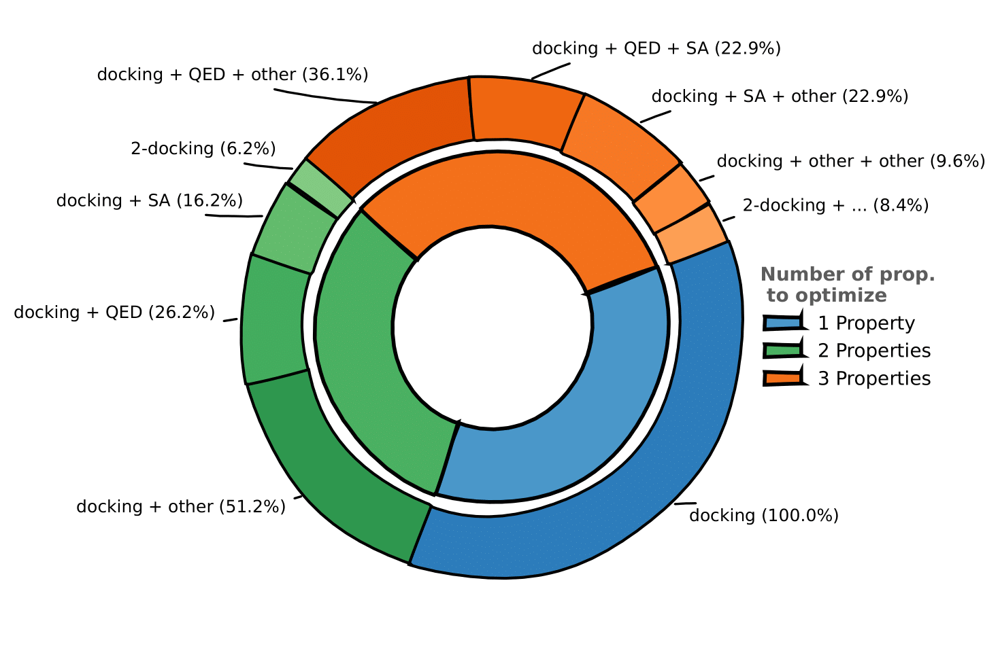

# *De Novo* Molecular Generation Tasks

## Overview

The primary task in our benchmark is **de novo molecular generation**, which involves generating novel molecular compounds while optimizing a set of desirable properties. This task is fundamental to drug discovery, where the goal is to identify candidate molecules that satisfy multiple criteria simultaneously.

In this setting, no high-scoring molecule is known a priori—the generative model must identify drug candidates with no prior information on which molecules are promising. The task is inherently multi-objective: generated candidates must simultaneously satisfy multiple criteria, such as:

- **Binding affinity**: The ability to bind to a specific protein target
- **Drug-likeness**: Compliance with rules that predict good pharmacokinetic properties
- **Synthetic accessibility**: The feasibility of synthesizing the molecule in a laboratory

### Dataset Statistics

| Split | Number of Prompts | Description                                                                                   |
|-------|-------------------|-----------------------------------------------------------------------------------------------|
| Training | 49,000            | Multi-objective optimization prompts                                                          |
| Evaluation | 1,000             | Held-out prompts for validation (binding targets are OOD, i.e not present in training set)    |
| Test | 1,000             | Final evaluation (binding targets are OOD, i.e not present in training set or evaluation set) |

The dataset is well-balanced across optimization complexity:

- **Single-property optimization**: 29% of prompts
- **Two-property optimization**: 36% of prompts
- **Three-property optimization**: 35% of prompts

## Docking Simulations

### What is Molecular Docking?

<small>(Roy, Aritra (2021). Molecular Docking First Try.gif. figshare. https://doi.org/10.6084/m9.figshare.14676669.v1)</small>

Molecular docking is a computational technique that predicts the preferred orientation of a small molecule (ligand) when bound to a protein target. The **docking score** quantifies the strength of this interaction—lower scores indicate better binding affinity.

Docking is a standard computational tool in drug discovery to evaluate how well a compound fits into a protein's binding pocket, making it an ideal objective for molecular generation tasks.

### Protein Structure Sources

We extracted protein structures from two main sources:

#### SAIR Dataset
The [SAIR dataset](https://huggingface.co/datasets/SandboxAQ/SAIR) consists of over 1 million protein-ligand pairs from approximately 5,000 unique protein structures. This dataset was built upon the structural predictions of [Boltz1](https://github.com/jwohlwend/boltz), a co-folding AI model, and notably contains predicted protein structures for which no known experimental structure exists.

#### SIU Dataset
We complemented the SAIR structures with proteins from the [SIU dataset](https://huggingface.co/datasets/bgao95/SIU), which provides labeled binding pockets.

### Pocket Identification

In the SAIR dataset, binding pockets are not pre-defined.
To identify binding pockets for each protein structure, we performed a clustering of the protein's residues based on the predicted receptor-ligand structure. The pipeline:

1. **Filters structures** to retain only high-quality ligand poses (top 50% by pIC50 potency and confidence score)
2. **Identifies pocket residues** by finding the closest protein residues to each ligand atom
3. **Clusters pockets** across multiple conformations using IoU-based similarity
4. **Selects representative conformations** by minimizing pairwise RMSD across pocket residues

After processing all structures with [Meeko](https://github.com/forlilab/Meeko), we obtained **4,500 protein structures**, each associated with a unique UniProt ID.

## Description of Molecular Properties to be Optimized

In addition to docking scores, our benchmark includes **12 classical molecular properties** computed using [RDKit](https://www.rdkit.org/). These properties are essential for evaluating drug-likeness and pharmacokinetic characteristics.

### Drug-likeness Properties

-   :material-star-circle:{ .lg .middle } __QED (Quantitative Estimate of Drug-likeness)__

    ---

    A composite score combining multiple molecular properties to estimate how "drug-like" a molecule is. QED ranges from 0 to 1, with higher values indicating better drug-likeness.

    **Typical objective**: Maximize or keep above a threshold (e.g., > 0.5)

-   :material-flask:{ .lg .middle } __SA Score (Synthetic Accessibility)__

    ---

    Estimates how difficult a molecule is to synthesize, ranging from 1 (easy) to 10 (difficult). The score considers fragment contributions and complexity penalties.

    **Typical objective**: Minimize or keep below a threshold (e.g., < 4)

### Physicochemical Properties

-   :material-water:{ .lg .middle } __LogP (Partition Coefficient)__

    ---

    The logarithm of the octanol-water partition coefficient, measuring lipophilicity. Optimal values for oral drugs typically range from 1 to 5 (Lipinski's Rule of Five).

    **Typical objective**: Keep within a range or minimize (to improve solubility)

-   :material-weight:{ .lg .middle } __Exact Molecular Weight__

    ---

    The molecular mass in Daltons. Drug-like molecules typically have molecular weights below 500 Da.

    **Typical objective**: Keep below a threshold (e.g., < 500 Da)

-   :material-circle-opacity:{ .lg .middle } __TPSA (Topological Polar Surface Area)__

    ---

    The surface area occupied by polar atoms (N, O, and their attached hydrogens). TPSA affects membrane permeability and oral absorption.

    **Typical objective**: Keep below a threshold (e.g., < 140 Ų for oral bioavailability)

### Structural Properties

-   :material-link-variant:{ .lg .middle } __Number of Hydrogen Bond Acceptors (NumHBA)__

    ---

    Atoms capable of accepting hydrogen bonds. Lipinski's Rule suggests ≤ 10 acceptors for oral drugs.

-   :material-link:{ .lg .middle } __Number of Hydrogen Bond Donors (NumHBD)__

    ---

    Atoms capable of donating hydrogen bonds. Lipinski's Rule suggests ≤ 5 donors for oral drugs.

-   :material-rotate-3d-variant:{ .lg .middle } __Number of Rotatable Bonds (NumRotatableBonds)__

    ---

    Bonds that allow free rotation, affecting molecular flexibility. Fewer rotatable bonds (≤ 10) generally improve oral bioavailability.

-   :material-hexagon-multiple:{ .lg .middle } __Number of Aromatic Rings (NumAromaticRings)__

    ---

    Count of aromatic ring systems. Too many aromatic rings can reduce solubility and increase toxicity risk.

-   :material-cube-outline:{ .lg .middle } __Fraction of sp³ Carbons (FractionCSP3)__

    ---

    The ratio of sp³-hybridized carbons to total carbons. Higher values indicate more three-dimensionality, which is associated with better selectivity and fewer off-target effects.

### Shape and Complexity Descriptors

-   :material-shape:{ .lg .middle } __Hall-Kier Alpha__

    ---

    A molecular connectivity index describing molecular shape and branching.

-   :material-arrow-expand-all:{ .lg .middle } __Phi (Flexibility Index)__

    ---

    A descriptor related to molecular flexibility derived from the Kier shape indices.

### Property Distribution in Dataset

Properties are sampled with varying probabilities to encourage generation of feasible, drug-like molecules:

| Property | Relative Frequency | Allowed Objectives                           |
|----------|--------------------|----------------------------------------------|
| QED | High (7.0)         | Maximize, Above threshold                    |
| SA Score | High (3.0)         | Minimize, Below threshold                    |
| LogP | Medium (2)       | Above or Below threshold, Minimize, Maximize |
| Phi | Medium (0.5)       | Above or Below threshold, Minimize, Maximize |
| Exact Molecular Weight | Low (0.8)          | Above or Below threshold                     |
| TPSA | Low (0.6)          | Above or Below threshold                              |
| Other properties | Low (0.3-0.5)      | Various                                      |

## Reward Function

The reward for molecular generation is computed as the **geometric mean** of per-property rewards:

$$R(q, \hat{y}) = \left(\prod_{i=1}^{n} r_i\right)^{1/n}$$

Where $r_i$ is the reward for the $i$-th property objective and $n$ is the total number of properties. Using the geometric mean ensures that only completions effectively optimizing **all** properties are rewarded—a single per-property reward of 0 results in a total reward of 0.

### Per-Property Reward Functions

The reward for each individual property depends on its optimization objective. We call $\rho$ the normalized property value, scaled to [0, 1] of a generated molecule.

-   :material-trending-up:{ .lg .middle } __Maximize Objective__

    ---

    $$R = \rho \in [0, 1]$$

    The reward is simply the normalized property value. Higher property values receive higher rewards.

-   :material-trending-down:{ .lg .middle } __Minimize Objective__

    ---

    $$R = 1 - \rho$$

    The reward is the inverse of the normalized property value. Lower property values receive higher rewards.

-   :material-check-circle-outline:{ .lg .middle } __Above Threshold__

    ---

    $$R = \begin{cases} 1 & \text{if } \rho \geq \text{threshold} \\ 0 & \text{otherwise} \end{cases}$$

    Binary reward: full reward if the property meets or exceeds the threshold, zero otherwise.

-   :material-minus-circle-outline:{ .lg .middle } __Below Threshold__

    ---

    $$R = \begin{cases} 1 & \text{if } \rho \leq \text{threshold} \\ 0 & \text{otherwise} \end{cases}$$

    Binary reward: full reward if the property is at or below the threshold, zero otherwise.

!!! warning "Invalid Molecules"
    If the generated SMILES string is invalid or cannot be parsed, the reward is automatically set to 0.

---
