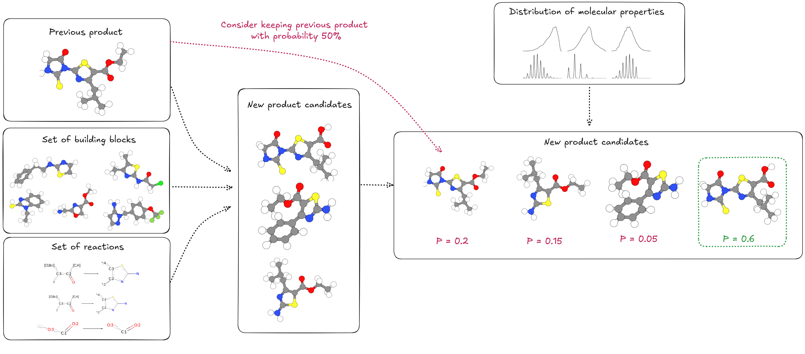

# Retro-Synthesis Tasks

This page describes the chemical reaction and retro-synthesis datasets used in our benchmark. These tasks investigate the influence of synthesis knowledge on molecular generation, helping models learn to generate compounds that are both optimized and synthetically accessible.

## Overview

| Split | Size | Description |
|-------|------|-------------|
| Training | 50,000 reactions | Multi-step synthesis routes with various task types |
| Test (ChEMBL) | 1,000 molecules | Real-world synthesis prediction |
| Test (Enamine) | 1,000 molecules | Real-world synthesis prediction |

### Task Distribution

The training dataset includes four main task types:

| Task Type | Proportion | Description |
|-----------|------------|-------------|
| Retro-synthesis Planning | 60% | Predict complete multi-step synthesis pathways |
| Reactant Prediction | 25% | Identify missing reactants for a reaction step |
| SMARTS Prediction | 10% | Predict the reaction template (SMARTS notation) |
| Product Prediction | 5% | Predict the final product of a multi-step synthesis |

### Synthesis Complexity

The dataset contains reactions of varying complexity:

- **Single-step reactions**: 20,000 (40%)
- **Two-step reactions**: 18,000 (36%)
- **Multi-step reactions (3-5 steps)**: 12,000 (24%)

---

## Data Generation Pipeline

We follow a methodology that employs building blocks from the [Enamine catalog](https://enamine.net/building-blocks/building-blocks-catalog) and **115 chemical reaction templates** described in SMARTS notation to generate multi-step reactions.

!!! note "References"
    This data generation approach is derived by:

        1. Lee et al., "Rethinking Molecule Synthesizability with Chain-of-Reaction." (2025)
        2. Gao et al., "Generative Artificial Intelligence for Navigating Synthesizable Chemical Space." (2024)
    by using their proposed **Reactant-Reaction Matrix**.

### Multi-Step Synthesis Generation

We generate synthetic pathways through an iterative stochastic process:

-   :material-play-circle:{ .lg .middle } __1. Initialization__

    ---

    Select a random seed reaction and identify available reactants via the compatibility matrix. Sample up to 10 valid reactant combinations and apply the reaction using RDKit. Filter products based on physicochemical properties and atom count.

-   :material-chart-bell-curve:{ .lg .middle } __2. Probabilistic Product Selection__

    ---

    For each valid product, compute a probability score based on a target distribution over molecular properties (QED, molecular weight, TPSA, H-bond donors/acceptors, rotatable bonds, aromatic rings). Products are selected proportionally to these scores.

-   :material-arrow-expand-right:{ .lg .middle } __3. Chain Extension__

    ---

    With up to 5 reaction steps, iteratively select a new reaction compatible with the last product, identify available reactant partners via the matrix, apply the reaction with property-based filtering, and add the product to the synthesis chain.

-   :material-stop-circle:{ .lg .middle } __4. Termination__

    ---

    Synthesis continues until the maximum number of steps is reached or no valid reactions can be applied. This ensures all pathways are chemically feasible.

### Molecular Property Filtering

Products must satisfy strict physicochemical constraints to remain in the dataset, ensuring drug-like molecules:

| Property | Min | Max |
|----------|-----|-----|
| QED (Drug-likeness) | 0.30 | 1.00 |
| Molecular Weight (Da) | 0 | 600 |
| TPSA (Ų) | 0 | 160 |
| H-Bond Acceptors | 0 | 10 |
| H-Bond Donors | 0 | 10 |
| Rotatable Bonds | 1 | 10 |
| Aromatic Rings | 0 | 6 |
| Atom Count | - | 60 |

### Target Distribution Modeling

Rather than using hard constraints alone, we compute log-probabilities for products via Beta distributions over normalized property ranges. This biases the stochastic selection toward drug-like molecules without rejecting valid synthetic products. The distribution parameters are tuned on the ZINC-250K dataset.

---

## Task Types

We created ten distinct objective templates to train models on complementary synthesis reasoning tasks:

### Single-Step Tasks

-   :material-flask-outline:{ .lg .middle } __Final Product Prediction__

    ---

    Predict the final product of a multi-step synthesis given the last reaction's SMARTS representation and reactants.

    ---
    **Training samples:** **~6.5k**

-   :material-help-circle:{ .lg .middle } __Reactant Prediction__

    ---

    Identify a missing reactant for a single synthesis step (always first step).

    ---
    **Training samples:** **~3k**

-   :material-format-list-bulleted:{ .lg .middle } __All Reactants Prediction__

    ---
    Given a reaction SMARTS and target product, predict all required reactants (always first step).

    ---
    **Training samples:**

    - **~1k** with no additional information
    - **~1.5k** with a set of building blocks provided

-   :material-code-braces:{ .lg .middle } __SMARTS Identification__

    ---

    Predict the SMARTS representation for a reaction step, given the reactants and product (any step of a synthesis).

    ---
    **Training samples:** **~1.5k**

### Multi-Step / Path Tasks

-   :material-sitemap:{ .lg .middle } __Full Synthesis Path__

    ---

    Generate a complete multi-step synthesis pathway to a target molecule.

    ---
    **Training samples:**

    - **~6.5k** with not additional information
    - **~6.5k** with a set of SMARTS templates provided
    - **~6.5k** with the 4, 8 or 16 most similar building blocks to the target molecule provided
    - **~3k** with both SMARTS templates and most similar building blocks provided

-   :material-sitemap-outline:{ .lg .middle } __Full Path With Interm. Products__

    ---

    Generate a complete multi-step synthesis pathway to a target molecule, given possible intermediate products to help guide the model.

    ---
    **Training samples:**

    - **~6.5k** with not additional information
    - **~6.5k** with a building blocks available (including the ones used in the synthesis)

---

## Reward Functions

The reward functions for chemical reaction tasks are designed to progressively guide the model toward correct predictions:

-   :material-molecule:{ .lg .middle } __Reactant/Product Prediction__

    ---

    $$R = \begin{cases} 1 & \text{if prediction is correct} \\ 0 & \text{otherwise} \end{cases}$$

    Evaluates correctness by verifying if using the predicted reactants/products in the reaction yields the expected product/reactants.

-   :material-code-braces:{ .lg .middle } __SMARTS Prediction__

    ---

    $$R = \frac{9 \times \mathbb{1}_{SMARTS_{pred} = SMARTS_{ref}} + \mathbb{1}_{product\_match}}{10}$$

    High reward for exact SMARTS match, small reward if applying the predicted SMARTS produces the correct product.

-   :material-sitemap:{ .lg .middle } __Retro-Synthesis Planning__

    ---

    $$R = \left(\frac{n_{valid}}{n}\right)^2 \times \text{sim}(target, \hat{y})^3$$

    Where $n_{valid}$ is the number of valid steps, $n$ is total steps, and $\hat{y}$ is the last valid product. Rewards increase with valid step proportion and Tanimoto similarity to target.

!!! warning "Invalid Predictions"
    If the extracted answer is invalid (unparseable SMILES, invalid reaction), the reward is automatically set to 0.

---

## Evaluation

### Test Sets

Following established methodology, we evaluate on **real-world synthesis prediction** rather than synthetic data:

| Test Set | Size | Description |
|----------|------|-------------|
| ChEMBL | 1,000 molecules | Drug-like molecules from the ChEMBL database |
| Enamine | 1,000 molecules | Molecules from the Enamine catalog |

For each molecule, we either:

1. Directly prompt the model to predict the synthesis route
2. Prompt the model to predict the synthesis route given a set of building blocks (4, 8, or 16 most similar to the target).

### Evaluation Metrics

Model performance is evaluated based on:

- **Success rate**: Proportion of molecules successfully synthesized using predicted routes
- **Tanimoto similarity**: Similarity between target molecule and synthesized product (when synthesis fails)
- **Valid step ratio**: Proportion of chemically valid steps in predicted routes

---

## References

1. Lee, S., et al. "Rethinking Molecule Synthesizability with Chain-of-Reaction." (2025)
2. Gao, W., et al. "Generative Artificial Intelligence for Navigating Synthesizable Chemical Space." (2024)
3. Enamine Building Blocks Catalog: https://enamine.net/building-blocks/building-blocks-catalog
